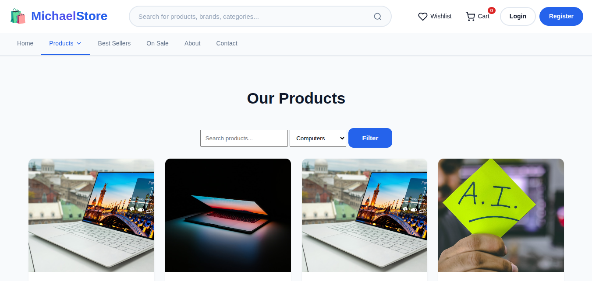
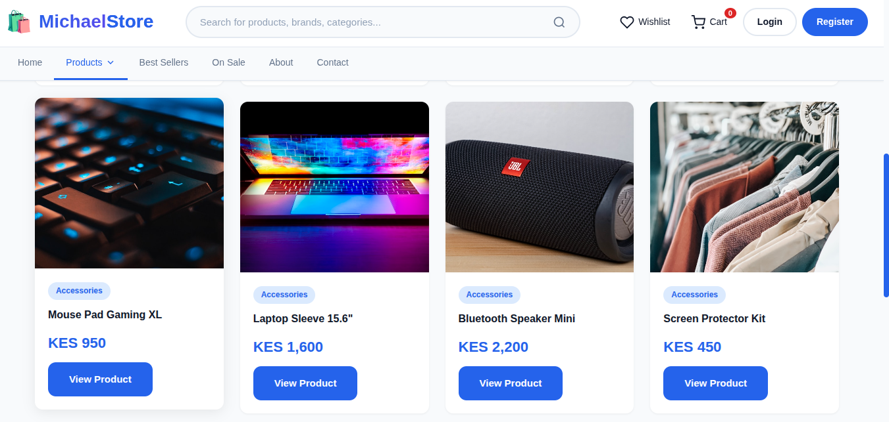
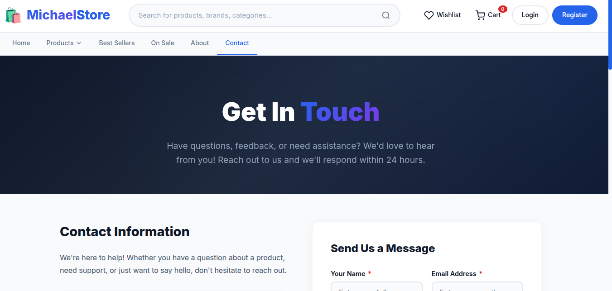
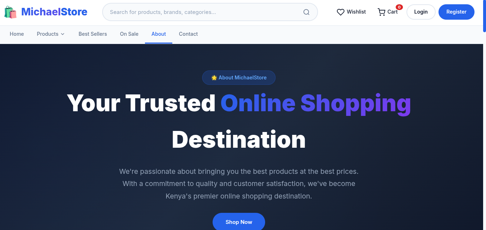

# 🛍️ MichaelStore - Modern E-Commerce Platform

[](http://michaelphotofolio.atwebpages.com/modern-e-commerce/)
[](https://php.net)
[](https://mysql.com)
[](LICENSE)

> A fully functional, modern e-commerce platform built with PHP, MySQL, and pure CSS - no frameworks required!

---
---


## 📸 Screenshots

### 🏠 Homepage


### 📱 Products Page


### 📄 Product Details


### 📧 Contact Page


### ℹ️ About Page


---

## 📸 Screenshots Gallery

<details>
<summary>Click to view all screenshots</summary>

### 🏠 Homepage


### 📱 Products Listing


### 📄 Product Details


### 📧 Contact Page


### ℹ️ About Page


## 🚀 Live Demo

**🔗 [View Live Demo](http://michaelphotofolio.atwebpages.com/modern-e-commerce/)**

---

</details>


## ✨ Features

### 🛒 Customer Features
- **User Authentication** - Register, Login, Logout with password hashing
- **Product Browsing** - View products by category with search and filter capabilities
- **Shopping Cart** - Add/remove items, update quantities, view cart total
- **Wishlist** - Save favorite products for later
- **Order Management** - View order history and track order status
- **Contact Form** - Send messages to support team
- **Newsletter** - Subscribe to updates and promotions
- **Payment Integration** - M-Pesa STK Push for mobile payments

### 👑 Admin Features
- **Dashboard Overview** - View key metrics (products, orders, revenue, users)
- **Product Management** - Add, edit, delete products with image upload
- **Order Management** - Update order status (pending, processing, shipped, delivered, cancelled)
- **User Management** - View and manage user accounts
- **Contact Messages** - View and reply to customer inquiries
- **Newsletter Subscribers** - Manage email subscribers
- **Inventory Management** - Track stock levels with low stock alerts

### 🎨 Design Features
- **Responsive Design** - Fully responsive across all devices
- **Premium Hero Slider** - Auto-rotating slides with smooth transitions
- **Mega Menu** - Category dropdown with featured sections
- **Floating Contact Icons** - Quick access to WhatsApp and phone support
- **Modern UI** - Clean, professional design with gradient accents
- **Interactive Elements** - Hover effects, animations, and smooth scrolling

---

## 🛠️ Technologies Used

### Backend
- **PHP 8.0+** - Server-side scripting
- **MySQL** - Database management
- **PDO** - Secure database connections

### Frontend
- **HTML5** - Semantic markup
- **CSS3** - Custom styling with CSS variables
- **JavaScript** - Interactive elements, slider, form validation
- **Emoji Icons** - Iconography

### Payment Integration
- **M-Pesa STK Push** - Mobile money payments (Safaricom)

---

## 📦 Installation Guide

### Prerequisites
- PHP 8.0 or higher
- MySQL 5.7 or higher
- Web server (Apache/Nginx)

### Step 1: Clone the Repository
```bash
git clone https://github.com/Michael237-web/e-commerce.git
cd e-commerce
